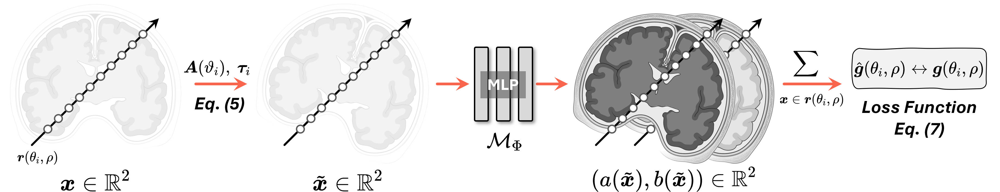
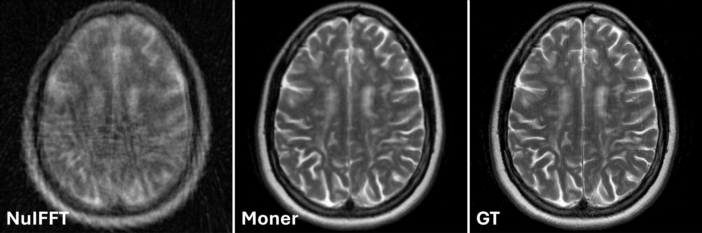

# Moner

This is the official implementation of our ICLR 2025 submission, **"Moner: Motion Correction in Undersampled Radial MRI with Unsupervised Neural Representation"**.

  
*Fig. 1: Overview of the proposed Moner model.*

## Visualization

  
*Fig. 2: Qualitative results of NuIFFT and Moner on 5 representative samples of the fastMRI dataset at AF=2 and MR=[-5, +5].*

## File Tree
```
Moner
│  config.yaml                  # configuration file.
│  dataset.py                   # dataloader
│  main.py                      # running script for training
│  model.py                     # motion correction module
│  readme.md                    # readme file
│  results.ipynb                # results report
│  train.py                     # training function
│  utils.py                     # tools
│
├─data
│      gt.nii                   # gt MR images
│      kdata_360_5.nii          # undersampled, motion-corrupted k-data
│      nuifft_360_5.nii         # NuIFFT MRI reconstructions
│      rot_360_5.txt            # gt motion parameter (rotation angle)
│      shift_x_360_5.txt        # gt motion parameter (X-axis shift)
│      shift_y_360_5.txt        # gt motion parameter (Y-axis shift)
│
├─fig                           # visualization
│      fig_method.jpg
│      fig_results.gif
│
├─model
│      model_360_5_0~4.pkl      # Moner checkpoints
│
└─out
        recon_360_5.nii         # Moner MRI reconstructions
        recon_reg_360_5.nii     # Moner MRI reconstructions after applying rigid registruction
        rot_360_5.txt           # estimated motion parameter (rotation angle)
        shift_x_360_5.txt       # estimated motion parameter (X-axis shift)
        shift_y_360_5.txt       # estimated motion parameter (Y-axis shift)
```


## Main Requirements
To run this project, you will need the following packages:
- PyTorch
- tinycudann
- torchkbnufft
- SimpleITK
- tqdm
- numpy
- other dependencies

## Training and Checkpoints

To train Moner from scratch, navigate to the project directory and run the following command in your terminal:

```bash
python main.py
```

This will train the Moner model on rigid motion-corrupted, undersampled *k*-space data from the fastMRI dataset at AF=2x and MR=[-5, +5] (`./data/kdata_360_5.nii`). The file `kdata_360_5.nii` is generated from the raw k-space data using the 1D IFFT operator, implemented in the function `ifft1d` in the `utils.py` file. The well-trained model checkpoints will be stored in `./model`, and the corresponding MR images and motion parameters will be saved in `./out`.


## Evaluation

To evaluate the results, run the `results.ipynb` notebook, which provides the quantitative results of the reconstructed MR images and the estimated motion parameters.

For the 5 projections (`./data/kdata_360_5.nii`), the quantitative results of the MR images are:

|Method         | PSNR  | SSIM |
|:------------------: |:--------------: | :------------: |
|NuIFFT   | 21.78 | 0.328 |
|Moner   | 32.53 | 0.935 |

## Others

NIFTI files (`.nii`) can be viewed using the ITK-SNAP software, available for free download at: http://www.itksnap.org/pmwiki/pmwiki.php?n=Downloads.SNAP4

<!-- # Moner

This is the official implementation of our ICLR 2025 submission "Moner: Motion Correction in Undersampled Radial MRI with Unsupervised Neural Representation"


*Fig. 1: Overview of the proposed Moner model.*


## Visualization


*Fig. 2: Qualitative results of NuIFFT and our Moner on 5 representative samples of the fastMRI dataset at AF=2 and MR=[-5, +5].*

## Main Requirements
To run this project, you will need the following packages:
- PyTorch
- tinycudann
- torchkbnufft
- SimpleITK, tqdm, numpy, and other packages.

## Training and Checkpoints

To train our Moner from scratch, navigate to `./` and run the following command in your terminal:

```bach
python main.py
```

This will train the Moner model for the rigid motion-currppted, undersampled *k*-space data from the fastMRI dataset at AF=2x and MR=[-5, +5] (`./data/kdata_360_5.nii`). Note that here the file `kdata_360_5` is generated from the raw *k*-space data via the 1D IFFT operator, implemented by the function `ifft1d` in file `utils.py`. The well-trained model checkpoints will be stored in `./model` and its corresponding MR images and motion paratmters will be stored in `./out`.

## Evaluation

To qualitatively evalute the results, the file `results.ipynb` reports the quantitave results of the reconstructed MR images and estimated motion paratmeters.


For the 5 projections (`./data/kdata_360_5.nii`), the quantitative results of the MR images are shown in:

|Method         | PSNR  | SSIM |
|:------------------: |:--------------: | :------------: |
|NuIFFT   | 21.78 | 0.328 |
|Moner   | 32.53 | 0.935 |


## Others

NIFTI files (`.nii`) can be viewed by using the ITK-SNAP software, which is available for free download at: http://www.itksnap.org/pmwiki/pmwiki.php?n=Downloads.SNAP4 -->